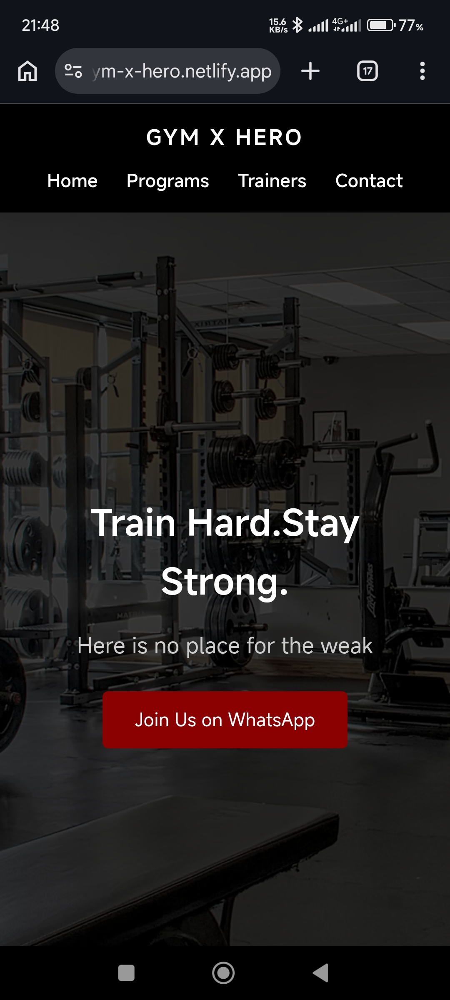

# 🏋️‍♂️ Yassine's Gym Website

A **modern, fully responsive gym website** designed and developed by **Yassine Nghima**.  
Perfect for fitness centers, personal trainers, or gyms that want a clean, engaging online presence.

## 🚀 Live Demo
[Check it out here!](https://gym-x-hero.netlify.app/)

## 🌟 Features
- Fully responsive design for **mobile & desktop**
- Smooth scrolling navigation for a seamless experience
- Interactive service & class sections
- Eye-catching hero & call-to-action buttons
- Clean and modern UI with subtle animations

## 🛠 Technologies
- HTML5  
- CSS3 (Flexbox & Grid)  
- JavaScript (vanilla)  
- Deployed on **Netlify**

## 📸 Screenshot
  

## 👨‍💻 Author
**Yassine Nghima**  
Web Developer & Designer
